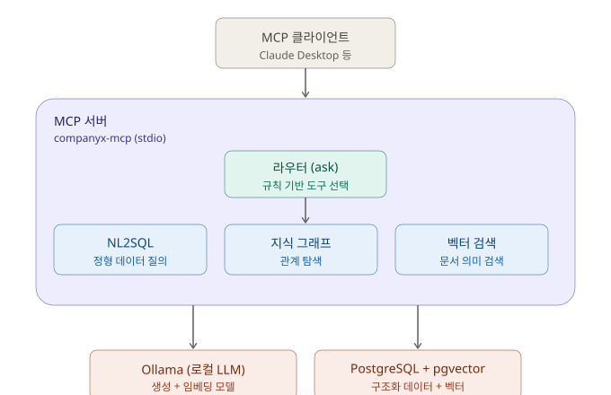

# MCP 기반 통합 지능형 데이터 검색 플랫폼

2026 오픈소스 개발자대회 · 리원에이스 지정과제("MCP 기반 지능형 데이터 플랫폼 클러스터") 출품작.

PostgreSQL(정형 데이터 + pgvector), 온프레미스 오픈웨이트 LLM(Ollama), 지식 그래프를 MCP(Model Context Protocol) 표준으로 연결해, 사용자가 자연어로 질문하면 NL2SQL·지식 그래프·벡터 검색 세 도구 중 알맞은 것을 규칙 기반 라우터가 자동으로 골라 답하는 시스템입니다.

원본 데이터셋 설명은 [DATASET.md](DATASET.md) 참고.

## 아키텍처



질문 1건이 처리되는 순서: **질문 → 라우터가 키워드 점수로 도구 선택 → 선택된 도구 실행(SQL 생성/그래프 순회/문서 검색) → 필요 시 Ollama·PostgreSQL 호출 → 근거(source)와 함께 자연어 답변 반환**.

## 디렉터리 구조

```
nl2sql/           NL2SQL 도구 — 자연어→SQL 변환, 읽기 전용 실행, 답변 생성
knowledge_graph/  지식 그래프 도구 — 질문→탐색 스펙 추출, networkx 순회, 답변 생성
vector_search/    벡터 검색 도구 — 문서 임베딩 파이프라인, pgvector 유사도 검색, 리랭킹, 답변 생성
mcp_server/       MCP 서버 — 위 3개 도구를 MCP 프로토콜로 노출, 규칙 기반 라우터
sql/, documents/, graph/, questions.json   원본 데이터셋 (DATASET.md 참고)
핵심로직_작업계획_및_검증기준.md   각 도구 설계 근거, 디버깅 기록, 통과 기준
```

## 설치 및 실행

### 1. 의존성

- Python 3.11+
- PostgreSQL 15+ (pgvector 확장 필수 — Windows 네이티브 PostgreSQL은 pgvector 미지원이라 **WSL 위에 별도 구축**함)
- [Ollama](https://ollama.com) — `gemma2:9b`(생성), `nomic-embed-text`(임베딩, 768차원)

```bash
pip install psycopg mcp networkx
ollama pull gemma2:9b
ollama pull nomic-embed-text
```

### 2. 데이터베이스 준비

```bash
# WSL 등 pgvector를 지원하는 PostgreSQL에서
createdb companyx
psql companyx -c "CREATE EXTENSION vector;"
psql companyx < sql/01-schema.sql
psql companyx < sql/02-data.sql
```

### 3. 환경 변수

```bash
export COMPANYX_DB_DSN="dbname=companyx host=localhost port=5434 user=postgres"
export PGPASSWORD="<DB 비밀번호>"        # 코드에 하드코딩하지 않음
export OLLAMA_HOST="http://localhost:11434"
```

### 4. 문서 임베딩 적재 (최초 1회)

```bash
python vector_search/embed.py
```

### 5. MCP 서버 실행

```bash
python mcp_server/server.py
```

## 테스트

각 도구 및 통합(라우터) 테스트는 `questions.json`의 예시 질문 30개(도구별 10개)를 기준으로 한다.

```bash
python nl2sql/test_nl2sql.py
python knowledge_graph/test_kg.py
python vector_search/test_vector.py
python mcp_server/test_router.py        # 라우터 단독 정확도
python mcp_server/test_integration.py   # 라우터+도구 통합
```

| 항목 | 결과 |
|---|---|
| NL2SQL | 10/10 |
| 지식 그래프 | 9~10/10 (데이터셋 자체 결함 1건 제외 시 만점) |
| 벡터 검색 | 10/10 |
| 라우터 정확도 | 30/30 (100%) |

세부 디버깅 기록·판정 기준은 [핵심로직_작업계획_및_검증기준.md](핵심로직_작업계획_및_검증기준.md) 참고.

## 준수 사항

- 로컬 오픈웨이트 LLM(Ollama)만 사용, 외부 상용 API 미사용
- 직접 작성한 소스코드는 MIT 라이선스([LICENSE](LICENSE)) 적용
- 비밀번호 등 자격 증명은 코드에 포함하지 않고 환경 변수로만 전달

## 라이선스

MIT License. [LICENSE](LICENSE) 참고.
